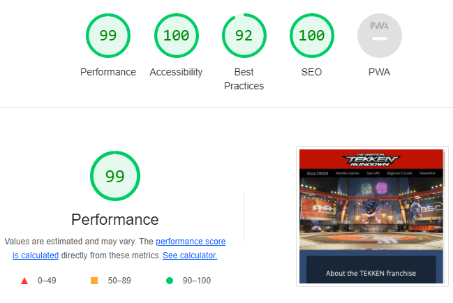

# The Unofficial TEKKEN Rundown

[The Unofficial TEKKEN Rundown website](https://andreeeasn.github.io/pp1-tekken-rundown/) was developed both to shed some light on the long-lasting history of the TEKKEN franchise and potentially attract some new players to the scene.
The user can scroll through a gallery of mainline TEKKEN games released over the years as well as some interesting spin-off titles featuring TEKKEN characters. 
The user may also read through the Beginner's Guide for a push in the right direction should they be willing to learn more about playing the game, as well as sign up for a newsletter regarding new TEKKEN releases, large tournament events and developer commentary.

# Table of Contents
+ [UX](#ux "UX")
  + [User Demographic](#user-demographic "User Demographic")
+ [Features](#features "Features")
  + [Navigation Bar](#navigation-bar "Navigation Bar")
  + [Hero Images](#hero-images "Hero Images")
  + [About TEKKEN Page](#about-tekken-page "About TEKKEN Page")
  + [Mainline Games Page](#mainline-games-page "Mainline Games Page")
  + [Spin-off Games Page](#spin-off-games-page "Spin-off Games Page")
  + [Beginner's Guide Page](#beginners-guide-page "Beginner's Guide Page")
  + [Newsletter Sign-Up Page](#newsletter-sign-up-page "Newsletter Sign-Up Page")
  + [Footer](#footer "Footer")
+ [Testing](#Testing "Testing")
  + [Validator Testing](#validator-testing "Validator Testing")
  + [Bugs Encountered](#bugs-encountered "Bugs Encountered")
+ [Media](#media "Media")
+ [Credits](#credits "Credits")

## UX

### User Demographic

This website was designed for:
  - Users interested in the background of the TEKKEN franchise wanting to know more
  - New players that have yet to begin playing due to the steep learning curve
  - Intermediate players wanting to brush up on their fighting game knowledge
  - Veteran players curious about the past entries of the series or receive news on upcoming content/events

## Features 

### Navigation Bar

  - Featured on all pages, allows the user to navigate freely between the 5 pages available (About TEKKEN, Mainline games, Spin-offs, Beginner's Guide and Newsletter)
  - The current page is highlighted on the navigation bar to quickly allow the user to see what page they're on.
  - The navigation bar will remain static on top of the screen, allowing the user to reach it from anywhere on the page. 
    
  - On smaller screens the navigation links will be replaced with a menu button that opens a vertical navigation menu. 
   
  

### Hero Images
  - Each page has it's own hero image featuring the various stages present in TEKKEN 7. 
  - The background color for each page is also influenced by the hero image, all mostly similar shades of desaturated blue but shifted towards other colors match their respective hero image.
  - About TEKKEN Page:
  
  - Mainline games Page:
  
  - Spinoff games Page:
  
  - Beginner's Guide Page:
  
  - Newsletter Page:
  

### About TEKKEN Page

  - The About TEKKEN Page serves as a landing page for users, giving a quick summary of what the TEKKEN franchise is.
  - The About section features a video trailer of TEKKEN 8, the newest installment in the series. 
  
  - Further down on the page is a TEKKEN World Tour Promo, featuring the TWT 2022 logo as well as a trailer. 
  
  - The Promo also features a summary of the TEKKEN World Tour and a link leading to the official Bandai Namco E-sports portal.

### Mainline Games Page

  - The Mainline Games Page functions as a gallery showing off all the official TEKKEN game releases over the years. 
   
  The image above shows the top and bottom of the page.
  - As the user scrolls through the gallery the background color will have a slight hue-shift towards blue (The same blue featured in the About TEKKEN Page)
  - Among the details listed are release date, platforms released on and what the game did differently from the other entries in the series.
  - Every game also features it's official logo on the left/right, each entry alternating which side displays the art.
  

### Spin-off Games Page

  - A follow-up to the Mainline Games page, except featuring spin-off titles instead. 
   
  The image above shows the top and bottom of the page.
  - As the user scrolls through the gallery the background color shift hues towards purple (The same purple used in the Mainline Games Page)
  - Release dates, platforms and official art are also displayed, similar to the Mainline Games Page
  - Every game also features it's official logo on the left/right, each entry alternating which side displays the art.

### Beginner's Guide Page

  - A fairly lenghty page to guide new players in the right direction should they find interest in playing. 
  
  - Features tables on input notations, basic movement and advanced directional inputs.
  - Also features some informational videos on choosing your character, TEKKEN movement techniques and general fighting game concepts.

### Newsletter Sign-Up Page

  - A sign-up form for the Unofficial TEKKEN Rundown Newsletter
  
  - The user is prompted to enter name, e-mail and region and may then select from 4 additional mailing lists (Upcoming Tekken DLC, Tekken World Tour, Nearby local tournaments and Developer commentary)
  - NOTICE - As the Code Institute Formdump page has been down for the last few weeks, submitting the form will not work as of now.
  
### Footer

  - The footer is split into three parts: a disclaimer that TEKKEN belongs to Bandai Namco, the fact that this website was created as a portfolio project as well as links to the creator's LinkedIn and GitHub. 
   
  - The footer is entirely responsive and resizes well to smaller screens 
   

## Testing

### Validator Testing
  - HTML
    - No errors were returned when testing all the pages through the [W3C HTML Validator](https://validator.w3.org/nu/?doc=https%3A%2F%2Fandreeeasn.github.io%2Fpp1-tekken-rundown%2Findex.html)  
  
  - CSS
    - No errors were returned when testing style.css through the [W3C CSS Jigsaw Validator](https://jigsaw.w3.org/css-validator/validator?uri=https%3A%2F%2Fandreeeasn.github.io%2Fpp1-tekken-rundown%2Findex.html&profile=css3svg&usermedium=all&warning=1&vextwarning=&lang=en) 
    
  - Lighthouse Audit 
  

### Bugs Encountered
  - (RESOLVED) The navigation bar menu button not hiding on larger screens when using firefox
    - The CSS tag content-visibility lacks browser compatibility with firefox and safari. Hiding elements with the simpler display: none; fixed the issue.
  
  - (RESOLVED) Right hand part of screen being cut off at lower screen widths on Beginner's Guide page
    - The headers above the notation tables were unable to break to a new line and as such stuck out of the container, this was fixed by adding style word-break: break-word; to the table.
    - There was also the phrase "strengths/weaknesses" in a paragraph that counted as one very large word not allowing the container to resize properly at very small screen sizes, adding a space inbetween the words ("strengths / weaknesses") solved the issue
  
  - (RESOLVED) Inability to resize youtube videos in their video container
    - Wrapped the video container in a new "video padding" div, allowing change of padding to control size when needed.

  - (RESOLVED) GitHub and LinkedIn links in footer being pushed beneath the padding
    - Replaced the convoluted floated divs in the footer with a simple unordered list with display:flex; to line the 3 objects up in a lot cleaner fashion.
  
## Media
Fonts Used:
  - [Tarrget - by Iconian Fonts](https://www.fontspace.com/tarrget-font-f32924), used in the creation of the Unofficial TEKKEN Rundown logo, based on the TEKKEN Tag Tournament logo font. 
  - [Open Sans](https://fonts.google.com/specimen/Open+Sans) used for headers, closely resembles the font used in the TEKKEN 7 Main Menu.
  
Images used:
  - The README presentation image was taken from [Am I Responsive?](https://ui.dev/amiresponsive)
  - All hero images are in-game captures of TEKKEN 7 (Owned by Bandai Namco), taken using Nvidia GeForce Experience Photo Mode.
  - Logos for mainline games 1-7 and icons for input notations are from the Gallery included in the official TEKKEN 7 release.
  - The TEKKEN 8 and TEKKEN World Tour logos used are from the [Official Bandai Namco Website](https://en.bandainamcoent.eu/tekken).

Videos used: 
  - [TEKKEN 8 Trailer](https://youtu.be/jGQBmSsunT4) & [TEKKEN World Tour 2022 trailer](https://youtu.be/_32qDPgfn6Y) from the official Bandai Namco Entertainment Youtube channels
  - [The Korean Backdash](https://youtu.be/dzIfubaQLyk), [Why Button Mashing Doesn't Work](https://youtu.be/riGCdE6ZPck) and [Why Button Mashing Works (Sometimes)](https://youtu.be/b2wX4EiD5tg) are all from @Core-A Gaming on youtube.

## Credits

Resources and tutorials used for developing this project:
  - [w3cschools.com - How to Create a Sticky Navbar](https://www.w3schools.com/howto/howto_js_navbar_sticky.asp)
  - [w3cschools.com - HTML Tables](https://www.w3schools.com/html/html_tables.asp)
  - [webdevetc.com - How to add a gradient overlay to a background](https://webdevetc.com/blog/how-to-add-a-gradient-overlay-to-a-background-image-using-just-css-and-html/)
  - [css-tricks.com - Three CSS Alternatives to JavaScript Navigation](https://css-tricks.com/three-css-alternatives-to-javascript-navigation/#aa-alternative-3-the-css-only-hamburger-menu)  
  This project uses edited CSS code from this tutorial in particular (Alternative 3: The CSS-only hamburger menu, written by Blake Lundquist) to create a mobile navigation menu without having to resort to javascript.
  - Most information regarding release dates, platforms and content from previous TEKKEN installments came from the [TEKKEN Wiki](https://tekken.fandom.com/wiki/Tekken_Wiki).

Big thanks to my Code Institute mentor, [Lauren-Nicole Popich](https://www.linkedin.com/in/lauren-nicole-popich-1ab87539/) for helping push the project in the right direction.