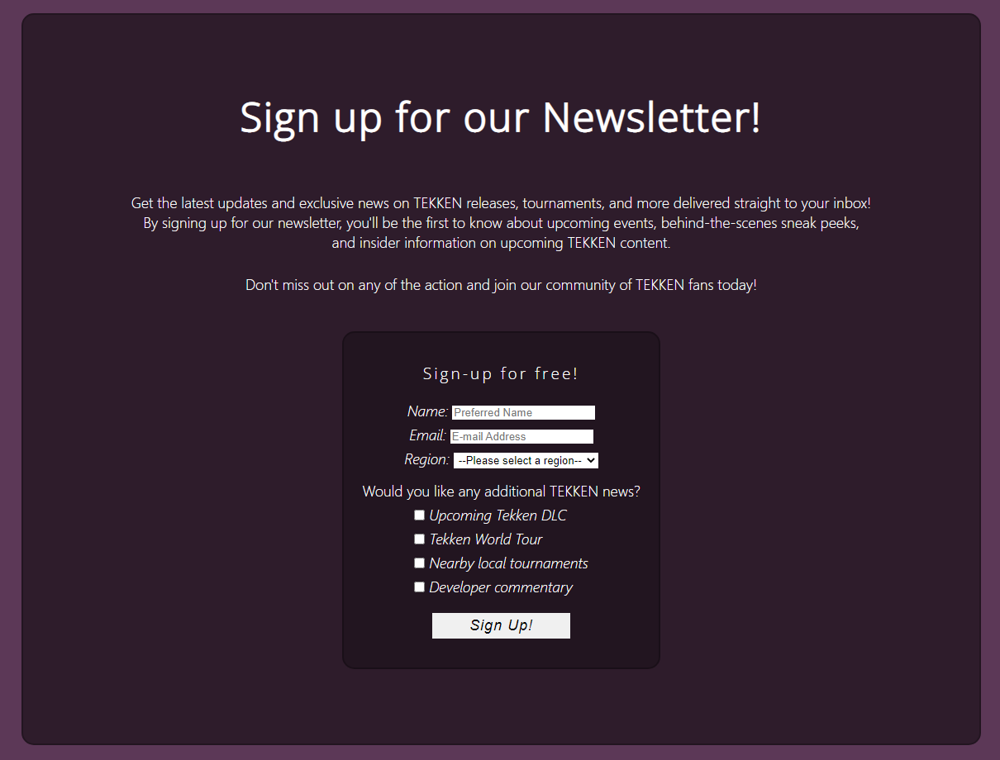

# The Unofficial TEKKEN Rundown

[The Unofficial TEKKEN Rundown website](https://andreeeasn.github.io/pp1-tekken-rundown/) was developed both to shed some light on the long-lasting history of the TEKKEN franchise and potentially attract some new players to the scene.
The user can scroll through a gallery of mainline TEKKEN games released over the years as well as some interesting spin-off titles featuring TEKKEN characters. 
The user may also read through the Beginner's Guide for a push in the right direction should they be willing to learn more about playing the game, as well as sign up for a newsletter regarding new TEKKEN releases, large tournament events and developer commentary.

## Features 

### Existing Features

- __Navigation Bar__

  - Featured on all pages, allows the user to navigate freely between the 5 pages available (About TEKKEN, Mainline games, Spin-offs, Beginner's Guide and Newsletter)
  - The current page is highlighted on the navigation bar to quickly allow the user to see what page they're on.
  - The navigation bar will remain static on top of the screen, allowing the user to reach it from anywhere on the page. 
    
  - On smaller screens the navigation links will be replaced with a menu button that opens a vertical navigation menu. 
  - 
  

- __Hero Images__

    - Each page has it's own hero image featuring the various stages present in TEKKEN 7. 
    The background color for each page is also influenced by the hero image, all mostly similar shades of desaturated blue but shifted towards other colors match their respective hero image.
        - About TEKKEN Page:
        
        - Mainline games Page:
        
        - Spinoff games Page:
        
        - Beginner's Guide Page:
        
        - Newsletter Page:
        

- __About TEKKEN Page__

  - The About TEKKEN Page serves as a landing page for users, giving a quick summary of what the TEKKEN franchise is.
  - The About section features a video trailer of TEKKEN 8, the newest installment in the series.
  
  - Further down on the page is a TEKKEN World Tour Promo, featuring the TWT 2022 logo as well as a trailer.
  
  - The background color transitions from a calm blue to TEKKEN 7's signature red as it reaches the trailer.
  - The Promo also features a summary of the TEKKEN World Tour and a link leading to the official Bandai Namco E-sports portal.

- __Mainline Games Page__

  - The Mainline Games Page functions as a gallery showing off all the official TEKKEN game releases over the years.
  - Among the details listed are release date, platforms released on and what the game did differently from the other entries in the series.
  - Every game also features it's official logo on the left/right, each entry alternating which side displays the art.

- __Spin-off Games Page__

  - A follow-up to the Mainline Games page, except featuring spin-off titles instead.
  - Release dates, platforms and official art are also displayed, similar to the Mainline Games Page
  - Every game also features it's official logo on the left/right, each entry alternating which side displays the art.

- __Beginner's Guide Page__

  - A fairly lenghty page to guide new players in the right direction should they find interest in playing.
  - Features tables on input notations, basic movement and advanced directional inputs.
  - Also features some informational videos on choosing your character, TEKKEN movement techniques and general fighting game concepts.

- __Newsletter Sign-Up Page__

  - A sign-up form for the Unofficial TEKKEN Rundown Newsletter
  
  - The user is prompted to enter name, e-mail and region and may then select from 4 additional mailing lists (Upcoming Tekken DLC, Tekken World Tour, Nearby local tournaments and Developer commentary)
  - NOTICE - As the Code Institute Formdump page has been down for the last few weeks, submitting the form will not work as of now.
  
- __The Footer__ 

  - The footer is split into three parts: a disclaimer that TEKKEN belongs to Bandai Namco, the fact that this website was created as a portfolio project as well as links to the creator's LinkedIn and GitHub. 
   
  - The footer is entirely responsive and resizes well to smaller screens 
   

